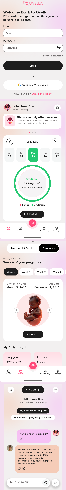

# Ovella Period Tracker App

Ovella Period Tracker App is a modern, user-friendly Flutter application designed to help users track their menstrual cycles, fertility windows, ovulation, and related health concerns. The app provides an intuitive calendar interface, cycle predictions, and logging features to empower users with insights into their reproductive health.

---

## Features

### 1. Menstrual Cycle Tracking
- **Period Logging**: Users can log the start and end dates of their periods, view historical data, and edit or remove entries as needed.
- **Calendar View**: Interactive calendar (with TableCalendar and custom calendar grid) visually displays logged periods, predicted cycles, and other highlighted days.

### 2. Fertility & Ovulation Prediction
- **Fertile Window Calculation**: Based on user input, the app automatically calculates and displays the most likely fertile days for each cycle.
- **Ovulation Prediction**: The app highlights the ovulation date, calculated as 14 days after the period start date.
- **Next Period Prediction**: Users can see predictions for their next expected period (typically 28 days after the last period start).
- **Visual Indicators**: Fertile days, ovulation, and predicted periods are color-coded on the calendar for easy identification.

### 3. Cycle & Date Selection
- **Period Date Range Selection**: Simple interface for picking the start and end dates of the last period.
- **Cycle Length Customization**: Users can adjust their cycle length for more accurate predictions.

### 4. Health Logging & Notes
- **Symptom Logging**: Users can log symptoms (e.g., cramps, mood changes) and general health notes for any day.
- **Add/Edit/Delete Notes**: Notes and logs can be managed directly from the calendar or dedicated logging screens.

### 5. Alerts & Reminders
- **Period Alerts**: Dialog sheets and activity tiles help users manage period data, add notes, or edit/remove entries.
- **Fertility & Ovulation Alerts**: Users receive alerts for fertile windows and ovulation days to support family planning.
- **Next Period Alerts**: Get notified about the upcoming period for preparation.

### 6. User Experience
- **Modern UI**: Clean design with support for themes, responsive layouts, and custom color palettes.
- **Background Widgets**: Visually appealing backgrounds for main screens.
- **Accessibility**: Designed for ease of use with clear instructions and large tap targets.

### 7. Data Persistence
- **Local Storage**: All period, fertility, and symptom data are stored locally for privacy and offline access.
- **Hive Integration**: Efficient and secure data management using Hive database for rapid access and updates.

### 8. Additional Features
- **Period Tips**: Rotating tips and advice for period health and wellness.
- **Mood Tracking**: Users can log and edit daily moods.
- **Edit Calendar**: Users can manually edit selected days in the calendar to fine-tune predictions and logs.

---

## Installation

1. **Clone the Repository**
   ```bash
   git clone https://github.com/salmanbashar1009/ovella_period_tracker_app.git
   cd ovella_period_tracker_app
   ```

2. **Install Dependencies**
   ```bash
   flutter pub get
   ```

3. **Run the App**
   ```bash
   flutter run
   ```

---

## Usage

- **Log Your Period**: Tap "Edit Period" to log or modify period dates.
- **View Calendar**: The main calendar screen displays all tracked and predicted cycle data.
- **Track Symptoms**: Use the "Log Symptoms" card to add daily health notes.
- **Check Fertility**: Fertile and ovulation days are highlighted for easy tracking.
- **Edit Calendar**: Access edit mode to adjust cycle dates and logs.

---

## Screenshots



---

## Technologies Used

- **Flutter** (cross-platform framework)
- **Provider** (state management)
- **Hive** (local storage)
- **TableCalendar** (calendar UI)
- **Custom Widgets** (for modern UX)

---

## Contributing

Contributions, issues, and feature requests are welcome! Feel free to check the [issues page](https://github.com/salmanbashar1009/ovella_period_tracker_app/issues).

---

## License

This project is licensed under the MIT License.

---

## Contact

For support or inquiries, please contact [salmanbashar1009](https://github.com/salmanbashar1009).